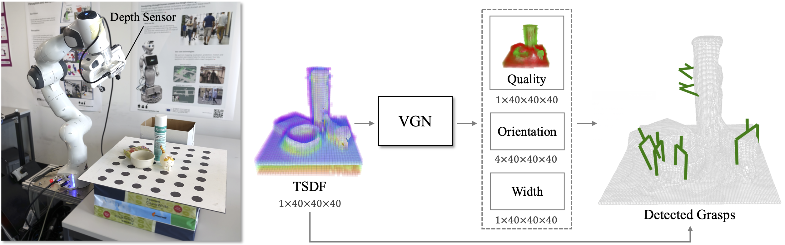

# Volumetric Grasping Network

**Note:** This is a cleaned-up branch including major reformatting. For the original code, checkout `corl2020`. The simulation is work in progress and will not produce the same results as the original publication.

---

VGN is a 3D convolutional neural network for real-time 6 DOF grasp pose detection. The network accepts a Truncated Signed Distance Function (TSDF) representation of the scene and outputs a volume of the same spatial resolution, where each cell contains the predicted quality, orientation, and width of a grasp executed at the center of the voxel. The network is trained on a synthetic grasping dataset generated with physics simulation.



This repository contains the implementation of the following publication:

* M. Breyer, J. J. Chung, L. Ott, R. Siegwart, and J. Nieto. Volumetric Grasping Network: Real-time 6 DOF Grasp Detection in Clutter. _Conference on Robot Learning (CoRL 2020)_, 2020. [[pdf](http://arxiv.org/abs/2101.01132)][[video](https://youtu.be/FXjvFDcV6E0)]

If you use this work in your research, please [cite](#citing) accordingly.

The next sections provide instructions for getting started with VGN.

* [Installation](#installation)
* [Dataset Generation](#data-generation)
* [Network Training](#network-training)
* [Simulated Grasping](#simulated-grasping)
* [Robot Grasping](#robot-grasping)

## Installation

The following instructions were tested on Ubuntu 20.04 with ROS Noetic.

Clone the repository into the `src` folder of a catkin workspace.

```
git clone https://github.com/ethz-asl/vgn
git clone https://github.com/mbreyer/robot_helpers
```

OpenMPI is optionally used to distribute the data generation over multiple cores/machines.

```
sudo apt install libopenmpi-dev
```

Create and activate a new virtual environment.

```
cd /path/to/vgn
python3 -m venv --system-site-packages /path/to/venv
source /path/to/venv/bin/activate
```

Install the Python dependencies within the activated virtual environment.

```
pip3 install -r requirements.txt
```

Build and source the catkin workspace.

```
catkin build vgn
source /path/to/catkin_ws/devel/setup.zsh
```

Finally, download the URDF models [here](https://drive.google.com/file/d/17S8Ie4hf52FuUqCdkcca8-gF-YfHNl8-/view) and place them inside of `assets`.

## Data Generation

Generate a database of labeled grasp configurations.

```
mpirun -np <num-workers> python3 scripts/generate_data.py --root=data/grasps/blocks
```

Next, clean and balance the data using the `process_data.ipynb` notebook.

You can also visualize a scene and the associated grasp configurations.

```
python3 scripts/visualize_data.py data/grasps/blocks
```

Finally, generate the voxel grid / grasp target pairs to train VGN.

```
python3 scripts/create_dataset.py data/grasps/blocks data/datasets/blocks
```

## Network Training

```
python3 scripts/train_vgn.py --dataset data/datasets/blocks --augment
```

## Simulated Grasping

```
python3 scripts/sim_grasp.py
```

## Robot Grasping

This package contains an example of open-loop grasp execution with a Franka Emika Panda and a wrist-mounted Intel Realsense D435.

Start a roscore and launch the ROS nodes.

```
roscore &
roslaunch vgn panda_grasp.launch
```

Run a grasping experiment.

```
python3 scripts/panda_grasp.py
```

## Citing

```
@inproceedings{breyer2020volumetric,
 title={Volumetric Grasping Network: Real-time 6 DOF Grasp Detection in Clutter},
 author={Breyer, Michel and Chung, Jen Jen and Ott, Lionel and Roland, Siegwart and Juan, Nieto},
 booktitle={Conference on Robot Learning},
 year={2020},
}
```
